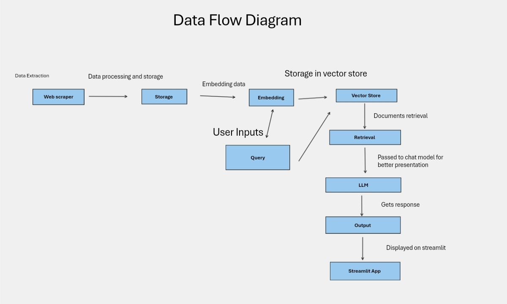

# StackAssist Demo

**LINK TO APP**: [my-ragdemo-drcrbd9xhqbjiwsq2tfz6l.streamlit.app](https://my-ragdemo-drcrbd9xhqbjiwsq2tfz6l.streamlit.app)

## Introduction

The StackAssist Demo is designed to enhance the StackUp community experience by providing a more efficient way to access information from the StackUp help center. My project uses modern AI techniques such as Retrieval Augmented Generation (RAG) to streamline finding specific information, making it quicker and more user-friendly.

## Summary of the Solution

This project comprises three main components:

1. **Web Scraper**: I custom-built a web scraper that extracts data from the StackUp help center, cleans it, and outputs a well-structured JSON document. This step ensures the data is in a format suitable for further processing and querying.

2. **Retrieval-Augmented Generation (RAG) System**: The RAG system, built using Langchain, Pinecone as a vector store, and TogetherAI for embeddings and chat language model queries, which forms the core of the solution. It allows users to enter questions and receive accurate, context-aware responses from the processed help center data.

3. **Streamlit App**: The user interface, built with Streamlit, mimics a ChatGPT setup where users can input their questions and get responses from the LLM. This makes it intuitive for users to interact with the system and obtain relevant information.

### Deployed Site and Working Prototype

The deployed version of the app can be accessed [here](https://my-ragdemo-drcrbd9xhqbjiwsq2tfz6l.streamlit.app). The prototype demonstrates the core functionality and provides a proof of concept for future enhancements.

### Video Demo

[Link to Video Demo](#) (Insert link to your video demo)

### Illustrations and Mock-ups

## Future Plans for Prototype Improvement 

- **Query Limits**: adding a feature to limit the number of queries per user to manage load and ensure fair usage.
- **Login Page**: Adding a user authentication system to personalize the experience and secure access. This is to ensure only stackies can gain access.
- **Model Improvements**: Enhancing the accuracy and efficiency of the LLM by integrating better models as they become available.

## Conclusion

The StackAssist  Demo offers a promising solution to improve the StackUp community experience. By utilizing advanced AI techniques, it addresses the challenges of finding specific information quickly and efficiently. With planned enhancements, the app has the potential to become an indispensable tool for both new and existing Stackies.
